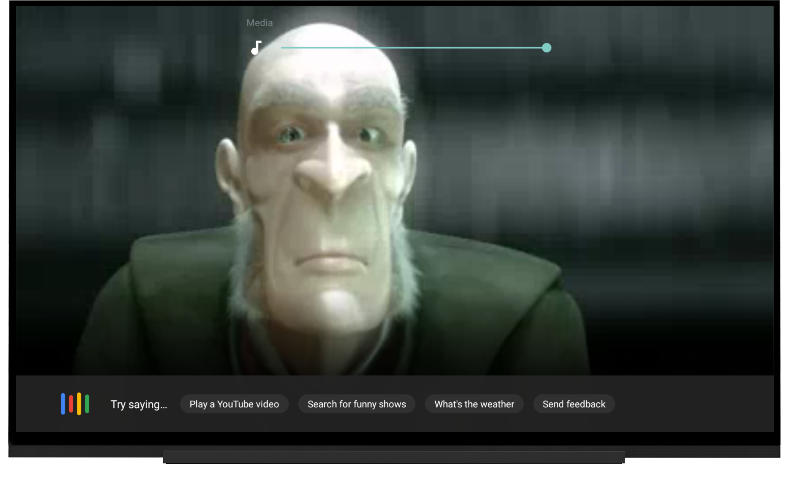

# Assistant on Android TV sample

This sample is designed to run on an Android TV device that supports the assistant (such as the NVIDIA SHIELD). It demonstrates how to interact with the user through the assistant to control playback.

## Introduction

- [Read more about Android TV introduction](http://www.android.com/tv/)
- [Android TV Developer Documentation](http://developer.android.com/tv)

## Dependencies

The only dependency required is the leanback support library. If you use Android Studio as recommended, the following dependencies will **automatically** be installed by Gradle.

## Getting Started

- Clone this repo:

```sh
git clone https://github.com/googlesamples/leanback-assistant.git
```

- Open the project in [Android Studio][studio].
- Compile and deploy to your Android TV device (such as a NVIDIA SHIELD).

Need more information about getting started with Android TV? Check the [official docs][getting-started].

## Screenshots

[](https://raw.githubusercontent.com/googlesamples/leanback-assistant/master/screenshots/assistant_popup.png)

[](https://raw.githubusercontent.com/googlesamples/leanback-assistant/master/screenshots/assistant_confirm.png)

## Support

If you need additional help, our community might be able to help.

- Android TV Google+ Community: [https://g.co/androidtvdev](https://g.co/androidtvdev)
- Stack Overflow: http://stackoverflow.com/questions/tagged/android-tv

## Contributing

We love contributions! :smile: Please follow the steps in the [CONTRIBUTING guide][contributing] to get started. If you found a bug, please file it [here][bugs].

## License

Licensed under the Apache 2.0 license. See the [LICENSE file][license] for details.

[store-apps]: https://play.google.com/store/apps/collection/promotion_3000e26_androidtv_apps_all
[studio]: https://developer.android.com/tools/studio/index.html
[getting-started]: https://developer.android.com/training/tv/start/start.html
[bugs]: https://github.com/googlesamples/androidtv-Leanback/issues/new
[contributing]: CONTRIBUTING.md
[license]: LICENSE